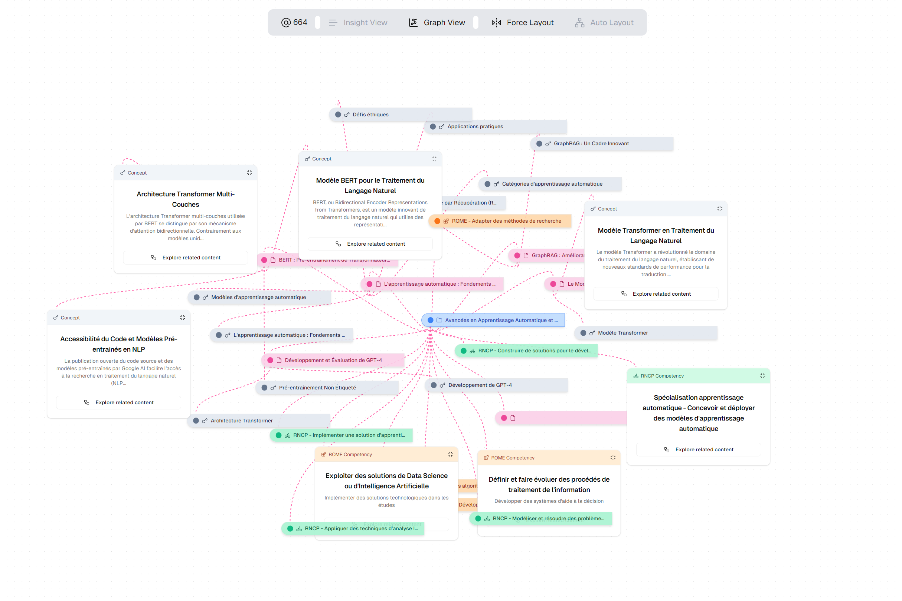

# Topii - Learn the Minds of Books 📚🧠✨

## Getting Started

Install all dependencies with:

```bash
yarn install
```

Then, run the development server:

```bash
yarn dev
```

Open [http://localhost:3000](http://localhost:3000) with your browser to see the result.

You can start editing components and appli in `app/` and see real-time updates to your application


